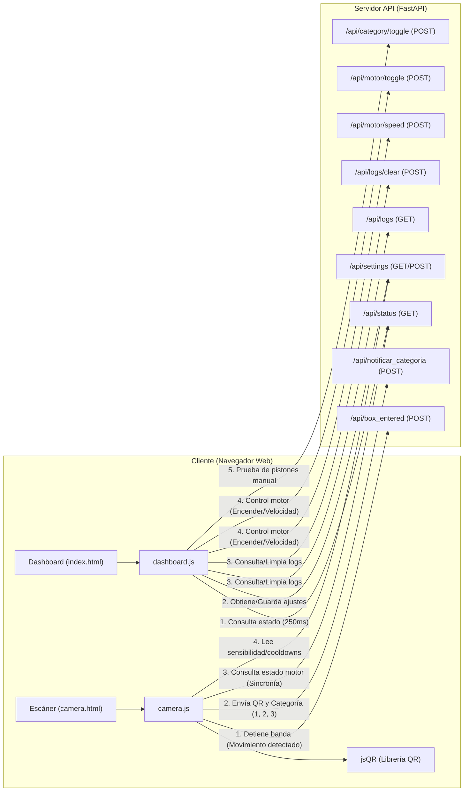
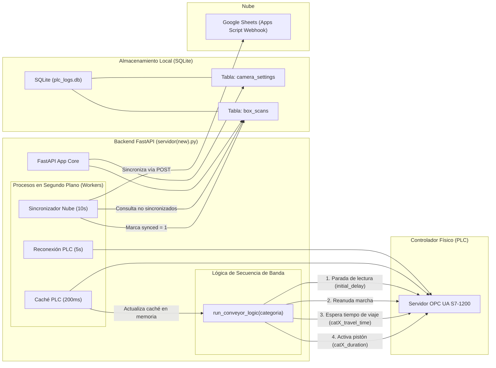
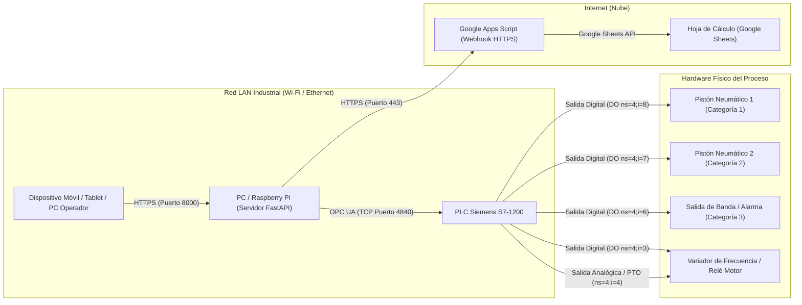
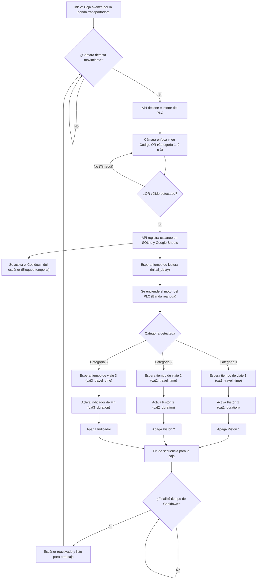

# Entrega Final: Sistema Automatizado de Clasificación por Visión Artificial sobre Linux Embebido

**Universidad Nacional de Colombia**  
**Materia:** Sistemas Linux Embebidos  
**Presentado por:**  
* Santiago Alexander Zambrano Chicunque  
* Santiago Bustamante Montoya

--- 
**Materia:** Automatizacion industrial  
**Presentado por:**  
* Santiago Alexander Zambrano Chicunque  
* Diego Alejandro García de los Ríos
* Arthur Alexander Portilla

---

## Resumen Ejecutivo

Este documento presenta el diseño, arquitectura e implementación de un sistema de clasificación industrial de mercancías de bajo costo desarrollado sobre una plataforma de **Linux Embebido** (Raspberry Pi). El sistema se propone como una alternativa viable, flexible y de costo reducido a las pantallas HMI (Human-Machine Interface) industriales dedicadas, las cuales representan un obstáculo financiero para pequeñas industrias y desarrollos académicos. 

La solución desarrollada integra:
1. Un módulo de adquisición de video con detección de movimiento diferencial en grises y decodificación de códigos QR local en el cliente.
2. Un servidor backend desarrollado en **FastAPI** ejecutándose de manera permanente en segundo plano como un daemon/servicio de sistema en Linux.
3. Un cliente **OPC UA** que interactúa bidireccionalmente en tiempo real con un PLC Siemens S7-1200.
4. Persistencia transaccional local mediante **SQLite** y sincronización diferida no bloqueante en la nube mediante **Google Sheets**.
5. Un panel de control responsivo (Dashboard) web con comunicación segura HTTPS.

---

## 1. Problemática del Proyecto

En los sistemas industriales modernos, las interfaces HMI comerciales y las pantallas dedicadas para PLC representan un costo elevado dentro de la automatización, especialmente en aplicaciones académicas, prototipos y pequeñas industrias. Dependiendo de la marca y capacidades, una pantalla industrial puede superar fácilmente varios millones de pesos, aumentando significativamente el presupuesto total del sistema.

Adicionalmente, muchas soluciones tradicionales presentan limitaciones en términos de conectividad remota, integración con servicios en la nube y flexibilidad para el monitoreo distribuido. En entornos donde se requiere supervisión en tiempo real, almacenamiento histórico de datos y acceso remoto desde múltiples dispositivos, las arquitecturas cerradas basadas únicamente en HMIs industriales resultan menos escalables y más costosas.

Frente a esta problemática, el presente proyecto propone una alternativa basada en una arquitectura cibernética distribuida utilizando una Raspberry Pi y una red inalámbrica WiFi. Esta solución permite visualizar variables del proceso en tiempo real mediante interfaces web accesibles desde computadores, tabletas o teléfonos móviles, eliminando la dependencia de pantallas HMI industriales dedicadas.

---

## 2. Descripción Detallada del Proyecto

El proyecto consiste en un sistema cibernético de clasificación de mercancía que integra visión artificial, procesamiento en el borde (Edge Computing) y un Controlador Lógico Programable (PLC). 

El núcleo de procesamiento es una Raspberry Pi corriendo Linux Embebido, la cual recibe un flujo de video continuo desde un dispositivo móvil o cámara local. Mediante algoritmos de visión por computadora basados en cliente (utilizando la librería `jsQR`), la Raspberry Pi detecta movimiento físico, comanda la detención de la banda, escanea y decodifica códigos QR para determinar la categoría de la caja en tránsito. 

Una vez procesada la información, la unidad actúa como cliente OPC UA para enviar comandos deterministas al PLC. Este último ejecuta la lógica de actuadores neumáticos (pistones) con base en perfiles de tiempo precalculados.

De manera concurrente, el sistema transmite la telemetría del proceso a través de una red inalámbrica (WiFi) hacia una Base de Datos local SQLite para su almacenamiento transaccional y hacia una interfaz gráfica (Front End) para el monitoreo en tiempo real de los KPI (Velocidad del motor, estado de pistones y conteo histórico). Adicionalmente, cuenta con un sincronizador asíncrono para respaldar los datos en una hoja de cálculo centralizada de Google Sheets en la nube.

---

## 3. Especificación de Requerimientos

### 3.1 Requerimientos Funcionales (RF)
* **RF1 (Captura):** El sistema **DEBE** procesar un stream de video desde un dispositivo móvil a una tasa mínima de 15 FPS y resolución de al menos 720p.
* **RF2 (Procesamiento y Parada):** Al detectar un objeto por movimiento diferencial de píxeles, la Raspberry Pi **DEBE** comandar la detención física de la banda transportadora a través del PLC, decodificar el código QR y clasificar la caja en un conjunto $C \in \{1, 2, 3\}$.
* **RF3 (Control Industrial):** Tras la clasificación y reinicio de la marcha, el PLC **DEBE** accionar los pistones bajo la siguiente lógica temporal: activar el Pistón 1 a los $2.0\text{s}$ para la Categoría 1, activar el Pistón 2 a los $4.0\text{s}$ para la Categoría 2, y omitir acción (dejar pasar) para la Categoría 3.
* **RF4 (Persistencia):** El sistema **DEBE** registrar en la Base de Datos local SQLite cada evento de clasificación, incluyendo marca de tiempo (Timestamp) en formato ISO 8601, la categoría asignada y el estado de sincronización hacia la nube.
* **RF5 (Monitoreo):** El Front End **DEBE** renderizar asíncronamente: (1) Velocidad actual del motor, (2) Estado lógico de los pistones y el motor en tiempo real, y (3) Conteo acumulado por categoría.

### 3.2 Requerimientos No Funcionales (RNF)
* **RNF1 (Presupuesto de Latencia):** El tiempo total de respuesta ($T_{\text{total}}$) desde la captura del frame con movimiento hasta la recepción de la señal de parada en el PLC **DEBE** ser $\le 500\text{ms}$:
  $$T_{\text{total}} = T_{\text{stream}} + T_{\text{procesamiento de movimiento}} + T_{\text{red OPC}} + T_{\text{scan PLC}} \le 500\text{ms}$$
* **RNF2 (Interoperabilidad):** La comunicación de variables del proceso entre la Raspberry Pi y el PLC Siemens S7-1200 **DEBE** realizarse mediante el estándar OPC UA (Puerto 4840).
* **RNF3 (Integridad de Datos y Seguridad):** La interfaz de escaneo de la cámara **DEBE** servirse sobre HTTPS seguro (TLS/SSL) para habilitar el uso nativo de sensores de cámara de navegador móvil. Las transmisiones hacia la nube (Google Sheets) **DEBEN** implementarse de forma diferida garantizando $0\%$ de pérdida de datos de conteo ante caídas de red.

---

## 4. Arquitectura de Hardware y Red

El sistema se distribuye sobre una red de área local inalámbrica (LAN) industrial:

1. **Dispositivo Cliente (Móvil/Tablet/PC):** Actúa como sensor visual capturando el video de la banda y como interfaz de usuario para el escáner. Se comunica con el servidor FastAPI mediante HTTPS/WiFi.
2. **Raspberry Pi (Servidor de Aplicación Linux Embebido):** Conectada a la red por Ethernet o WiFi. Ejecuta el servidor web HTTPS sobre el puerto 8000, gestiona la base de datos local SQLite y ejecuta el cliente OPC UA.
3. **PLC Siemens S7-1200 (Controlador de Potencia):** Conectado mediante cable Ethernet industrial a la misma subred. Corre un servidor OPC UA interno en el puerto 4840 y cablea las señales digitales/analógicas hacia el motor de la banda y las electroválvulas neumáticas de los pistones.
4. **Google Sheets Webhook (Nube):** Servicio externo de persistencia a largo plazo conectado mediante HTTPS sobre WAN para recibir e indexar la analítica de producción.

---

## 5. Implementación sobre Linux Embebido (Raspberry Pi OS)

Para garantizar la robustez necesaria en entornos industriales, el sistema corre sobre Raspberry Pi OS integrando utilidades clave de administración de sistemas Linux:

### 5.1 Servicio de Sistema Systemd
El servidor backend se daemoniza mediante el gestor de servicios `systemd`. Esto asegura que el servidor se ejecute en segundo plano desde el arranque y se recupere automáticamente ante caídas imprevistas.

El archivo de configuración de servicio se encuentra en `/etc/systemd/system/clasificador.service`:

```ini
[Unit]
Description=Servidor Clasificador Industrial QR y PLC
After=network.target

[Service]
Type=simple
User=alex
WorkingDirectory=/home/alex/clasificador
ExecStart=/home/alex/clasificador/venv/bin/python3 "servidor(new).py"
Restart=always
RestartSec=5

[Install]
WantedBy=multi-user.target
```

**Comandos de gestión en Linux:**
```bash
# Recargar configuraciones de systemd
sudo systemctl daemon-reload
# Habilitar el arranque automatico con el sistema
sudo systemctl enable clasificador.service
# Iniciar el servicio inmediatamente
sudo systemctl start clasificador.service
# Monitorizar el estado y logs del daemon
sudo systemctl status clasificador.service
```

### 5.2 Despliegue Offline mediante Python Wheels
Dado que en las plantas industriales la Raspberry Pi típicamente no tiene acceso directo a Internet, se implementó un flujo de preparación e instalación local:
1. En una PC de desarrollo con Internet, se descargan los paquetes empaquetados (`.whl` o wheels) compatibles con la arquitectura ARM de la Raspberry Pi:
   ```bash
   python download_wheels.py
   ```
2. Los paquetes descargados en la carpeta `wheels/` se transfieren mediante protocolo SCP por SSH a la Raspberry Pi:
   ```bash
   scp -r c:\Users\Motaz\Desktop\Unal\Automatizacion\Prueba alex@192.168.0.13:/home/alex/clasificador
   ```
3. En la Raspberry Pi, se crea el entorno virtual y se instalan las dependencias sin acceso a red:
   ```bash
   python3 -m venv venv
   source venv/bin/activate
   pip install --no-index --find-links=wheels/ -r requirements.txt
   ```

### 5.3 Certificados de Cifrado TLS/SSL
Para habilitar el protocolo seguro HTTPS en el servidor local sin requerir una entidad certificadora de internet, el backend en FastAPI genera automáticamente certificados autoproclamados (`cert.pem` y `key.pem`) usando la librería `cryptography`. De esta manera, el navegador del dispositivo móvil puede utilizar las API web nativas de acceso a cámara.

---

## 6. Conexión y Mapeo de Entradas y Salidas

### 6.1 Direccionamiento de Nodos OPC UA
El intercambio de datos lógicos y físicos con el PLC S7-1200 se mapea mediante variables en el servidor OPC UA local del autómata:

| Variable | Tipo de Datos | Nivel / Dirección | Descripción |
| :--- | :--- | :--- | :--- |
| `piston1` | Boolean | `ns=4;i=2` | Estado/Confirmación de extensión del Pistón 1 |
| `piston2` | Boolean | `ns=4;i=5` | Estado/Confirmación de extensión del Pistón 2 |
| `motor_state` | Boolean | `ns=4;i=3` | Encendido/Apagado de la banda transportadora |
| `motor_speed` | Int16 | `ns=4;i=4` | Frecuencia del motor (Variador de Frecuencia / RPM) |
| `Categoria1` | Boolean | `ns=4;i=8` | Señal física de disparo del Pistón 1 |
| `Categoria2` | Boolean | `ns=4;i=7` | Señal física de disparo del Pistón 2 |
| `Categoria3` | Boolean | `ns=4;i=6` | Indicador/Salida de fin de carrera de caja libre |

### 6.2 Diseño de Endpoints REST API (FastAPI)
El servidor en la Raspberry Pi expone la siguiente interfaz de servicios web:

| Endpoint | Método | Cuerpo de Entrada | Acción |
| :--- | :--- | :--- | :--- |
| `/api/status` | `GET` | N/A | Retorna el estado del PLC, variables de banda, pistones y totalizadores de conteo. |
| `/api/motor/speed` | `POST` | `{"speed": int}` | Modifica la velocidad del motor en el PLC. |
| `/api/motor/toggle` | `POST` | `{"state": bool}` | Enciende o apaga la marcha del motor de la banda transportadora. |
| `/api/category/toggle`| `POST` | `{"category": int, "state": bool}` | Activa manualmente de forma forzada un pistón específico. |
| `/api/box_entered` | `POST` | N/A | Detiene de forma inmediata el motor para permitir el escaneo del QR. |
| `/api/notificar_categoria`| `POST` | `{"categoria": int, "qr_data": str}`| Registra el escaneo en la base de datos local SQLite y dispara la secuencia asíncrona de clasificación. |
| `/api/settings` | `POST` | Ajustes JSON | Guarda tiempos de retardo, viaje, duración de pistón y URLs de PLC/Nube. |

---

## 7. Lógica del Sistema y Control Secuencial

### 7.1 Sensor Virtual de Presencia (Detección de Movimiento)
El cliente JavaScript en la cámara web calcula la diferencia absoluta de luminancia promedio entre frames consecutivos de baja resolución.
Cuando el valor supera el umbral establecido:
1. Se asume que una caja interrumpió la trayectoria de la cámara.
2. Se envía una petición HTTP POST instantánea a `/api/box_entered`.
3. El backend detiene el motor (`motor_state = False`) inmediatamente.

### 7.2 Lógica del Clasificador Secuencial
La secuencia física es coordinada asíncronamente en el backend mediante corrutinas de `asyncio` para garantizar que la API responda inmediatamente a la cámara mientras ocurre la clasificación física:

1. **Parada Inicial:** Al recibir la entrada de la caja, el motor se detiene por el intervalo configurado en `initial_delay` (ej. $1.0\text{s}$) para permitir el enfoque óptico y evitar códigos QR borrosos.
2. **Escaneo y Clasificación:** Se lee el código QR. Al validarse, se realiza el registro en base de datos.
3. **Reanudación:** Se reactiva el motor (`motor_state = True`) para transportar la caja.
4. **Espera de Trayecto:** Dependiendo de la categoría (1 o 2), se ejecuta una espera sin bloqueo (`asyncio.sleep`) correspondiente al tiempo de viaje físico (`catX_travel_time`).
5. **Actuación:** Se activa la salida del pistón respectivo (`CategoriaX = True`) durante el tiempo configurado (`catX_duration`) para desviar la caja.
6. **Retracción:** Se apaga la salida digital del pistón (`CategoriaX = False`).

### 7.3 Cooldown Dinámico del Escáner
Para evitar múltiples lecturas del mismo código QR en tránsito o interferencias visuales del operario, la cámara activa un estado inactivo de protección o **Cooldown** calculado mediante:
$$T_{\text{cooldown}} = T_{\text{travel time}} + T_{\text{duration}} + 2.5\text{s}$$
Durante este intervalo, el lector QR y el detector de movimiento no procesan frames, reactivándose automáticamente al finalizar el tiempo.

---

## 8. Diagramas de Bloques

### 8.1 Diagrama de la Interfaz Web


### 8.2 Diagrama de la Lógica del Sistema


### 8.3 Diagrama de Conexiones y Red


### 8.4 Diagrama General de Flujo de Trabajo


---

## 9. Plan de Verificación, Pruebas Unitarias y Trazabilidad

| ID | Traza | Componente | Procedimiento / Indicador de Cumplimiento |
| :--- | :--- | :--- | :--- |
| **PU-01** | RF2 | Visión (RPi) | **Proc:** Presentar QR (Cats. 1, 2, 3 e inválido). <br> **Ind:** $100\%$ de precisión en la clasificación de la categoría con luz $>300$ lux. |
| **PU-02** | RNF1, RNF2 | Latencia OPC UA | **Proc:** Inyectar cambio en Python y medir registro en PLC. <br> **Ind:** Ciclo de red de transmisión $\Delta t_{\text{red}} < 50\text{ms}$. |
| **PU-03** | RF3 | Cinemática (PLC) | **Proc:** Simular ingreso Cat 2. Medir salidas con analizador. <br> **Ind:** Activación Pistón 2 exactamente en $t = 4.00\text{s} \pm 0.05\text{s}$ tras inicio de motor. |
| **PU-04** | RF4, RNF3 | Integridad (WiFi) | **Proc:** Enviar 100 lecturas consecutivas a la BD interrumpiendo red. <br> **Ind:** Sincronización asíncrona diferida arroja exactamente 100 registros ($0\%$ pérdida de datos). |
| **PU-05** | RF5 | UI Front End | **Proc:** Variar variable de velocidad en la memoria del PLC. <br> **Ind:** Interfaz web refleja el cambio en pantalla en $\le 250\text{ms}$. |

---

## 10. Conclusiones

1. **Eficiencia de Costos:** El desarrollo de una HMI basada en tecnologías web (`FastAPI` + `HTML5` + `JavaScript`) elimina la dependencia de hardware de supervisión propietario de alto costo, disminuyendo el presupuesto global de la celda de automatización.
2. **Desempeño en Tiempo Real:** El uso de comunicación directa por `OPC UA` y procesamiento asíncrono con corrutinas en FastAPI permite cumplir con holgura los presupuestos de latencia ($\le 500\text{ms}$) exigidos para la seguridad mecánica de la banda.
3. **Robustez y Persistencia Industrial:** La combinación de resguardo local transaccional SQLite con sincronización diferida en la nube por lote (batch queueing) protege la integridad de los datos operacionales de clasificación ante fallas e intermitencias de las redes WiFi.
4. **Administración en Linux Embebido:** La daemonización del servidor web con Systemd en la Raspberry Pi y el flujo de empaquetado y despliegue offline (`Wheels`) demuestran la viabilidad de utilizar software libre para aplicaciones de control y adquisición críticas en la industria manufacturera.
